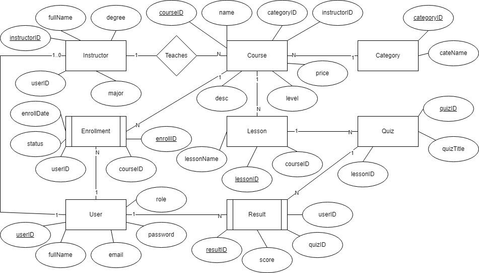

# Bài tập: Hệ thống Quản lý Lớp học Trực tuyến

## 1. Thực thể và khóa chính

- Người dùng (User): mã người dùng **(PK)**, họ tên, email, mật khẩu, vai trò
- Khóa học (Course): mã khóa học **(PK)**, tên khóa học, mô tả, cấp độ, giá, ngày phát hành
- Danh mục (Category): mã danh mục **(PK)**, tên danh mục
- Giảng viên (Instructor): mã giảng viên **(PK, FK)**, học vị, chuyên môn
- Đăng ký học (Enrollment): mã đăng ký **(PK)**, ngày đăng ký, trạng thái
- Bài học (Lesson): mã bài học **(PK)**, tiêu đề, nội dung, thời lượng
- Bài kiểm tra (Quiz): mã quiz **(PK)**, tiêu đề, số câu hỏi
- Kết quả (Result): mã kết quả **(PK)**, điểm, ngày làm

---

## 2. Mối quan hệ

- Một giảng viên có thể dạy nhiều khóa học
  + Instructor 1 - N Course
  + FK: instructorID trong Course

- Một khóa học thuộc về một danh mục
  + Course N - 1 Category
  + FK: categoryID trong Course

- Một khóa học có nhiều bài học
  + Course 1 - N Lesson
  + FK: courseID trong Lesson

- Một bài học có thể có nhiều quiz
  + Lesson 1 - N Quiz
  + FK: lessonID trong Quiz

- Một học viên có thể học nhiều khóa học
  + User 1 - N Enrollment N - 1 Course
  + FK: userID, courseID trong Enrollment

- Một học viên có thể làm nhiều quiz, mỗi lần làm có một Result riêng
  + User 1 - N Result N - 1 Quiz
  + FK: userID, quizID trong Result

- Giảng viên là một loại User
  + User 1 - 0..1 Instructor
  + FK: userID trong Instructor

## 3. Ghi chú

- User có thể có vai trò:
  + student
  + instructor

## 3.ERD:

[Open ERD](./imgs/E-learningClassManagementSystem.png)

