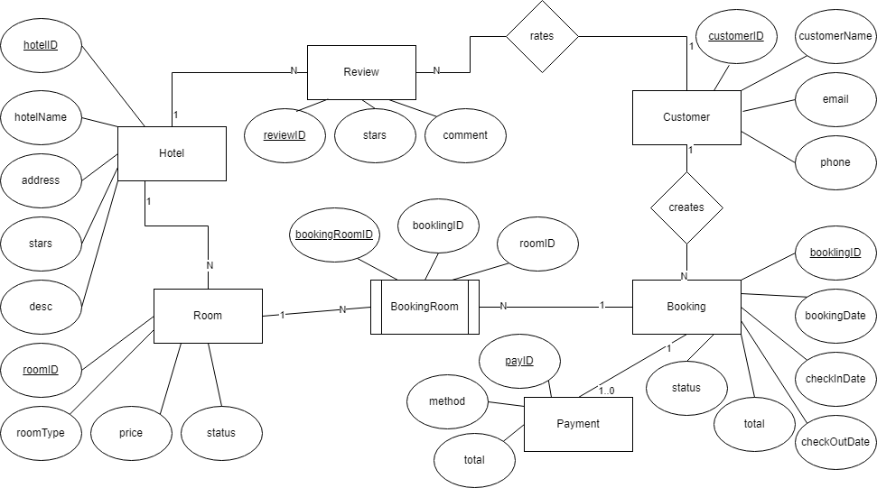

Bài tập: Hệ thống Quản lý Đặt phòng Khách sạn

## 1. Thực thể và khóa chính

- Khách sạn (Hotel): mã khách sạn **(PK)**, tên, địa chỉ, số sao, mô tả, người quản lý
- Phòng (Room): mã phòng **(PK)**, loại phòng (Deluxe, Standard...), giá mỗi đêm, tình trạng (trống, đã đặt), sức chứa
- Khách hàng (Customer): mã khách hàng **(PK)**, họ tên, email, số điện thoại, quốc tịch
- Đặt phòng (Booking): mã đặt phòng **(PK)**, ngày đặt, ngày nhận, ngày trả, tổng tiền, trạng thái (chờ, xác nhận, hủy)
- Thanh toán (Payment): mã thanh toán **(PK)**, phương thức (thẻ, chuyển khoản), ngày thanh toán, số tiền, trạng thái
- Đánh giá (Review): mã đánh giá **(PK)**, điểm số, bình luận, ngày đăng
- Chi tiết đặt phòng (BookingRoom): mã chi tiết đặt phòng **(PK)**, mã đặt phòng **(FK)**, mã phòng **(FK)**

## 2. Mối quan hệ

- Một khách sạn có nhiều phòng
  + Hotel 1 - N Room
  + FK: hotelID trong Room

- Một khách hàng có thể đặt nhiều phòng (qua nhiều booking)
  + Customer 1 - N Booking
  + FK: customerID trong Booking

- Một booking có thể gồm nhiều phòng (ví dụ đặt 2 phòng cùng lúc)
  + Booking 1 - N BookingRoom N - 1 Room
  + FK: bookingID, roomID trong BookingRoom 

- Một booking có đúng một thanh toán (nếu thành công)
  + Booking 1 - 1..0 Payment
  + FK: bookingID trong Payment

- Một khách hàng có thể viết nhiều đánh giá cho các khách sạn đã từng ở
  + Customer 1 - N Review
  + FK: customerID trong Review

- Một khách sạn có nhiều đánh giá:
  + Hotel 1 - N Review
  + FK: hotelID trong Review

## 3.ERD:

[Open ERD](./imgs/HotelsRoomBookingManagemenSystem.png)

