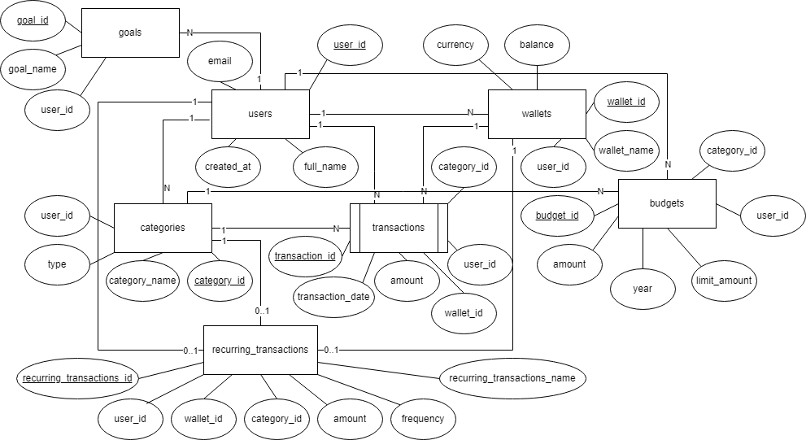

[Bài tập] Ứng dụng Quản lý Tài chính Cá nhân (Smart Finance Tracker)

## 1.Thực thể và khóa chính:

- users: user_id **PK**, full_name, email, created_at
- wallets: wallet_id **PK**, wallet_name, balance, currency, user_id
- categories: category_id **PK**, category_name, type, user_id
- transactions: transaction_id **PK**, transaction_date, amount, type, description, wallet_id, user_id, category_id
- recurring_transactions: cấu hình các tài khoản thu/chi tự động lặp lại hàng tháng (tiền nhà, tiền lương,...)
    + recurring_transaction_id **PK**, recurring_transaction_name, amount, user_id, wallet_id, category_id,type, start_date, end_date, description, frequency
- budgets: budget_id **PK**, month, year, limit_amount, user_id, category_id
- goals: goal_id **PK**, goal_name, target_amount, deadline, user_id

## 2.Mối quan hệ:

- 1 user có nhiều wallets:
    + users 1 - N wallets
    + FK: user_id trong wallets

- 1 user có nhiều categories:
    + users 1 - N categories
    + FK: user_id trong categories

- 1 user có nhiều transactions, 1 transaction chỉ trừ tiền 1 wallet:
    + users 1 - N transactions N - 1 wallets
    + FK: user_id, wallet_id trong transactions

- 1 category thuộc nhiều transaction/recurring_transactions:
    + categories 1 - N transactions
    + categories 1 - N recurring_transactions
    + FK: category_id trong transactions, recurring_transactions

- 1 user có thể có khoản thu/chi tự động hàng tháng:
    + users 1 - 0..1 recurring_transactions 0..1 - 1 wallets
    + FK: user_id, wallet_id trong recurring_transactions

- 1 user có nhiều ngân sách, 1 ngân sách thuộc về 1 danh mục:
    + users 1 - N budgets N - 1 categories
    + user_id, category_id trong budgets

- 1 user có nhiều goals:
    + users 1 - N goals 
    + FK: user_id trong goals

## 3.ERD:

[Open ERD](./imgs/SmartFinanceTracker.png)

