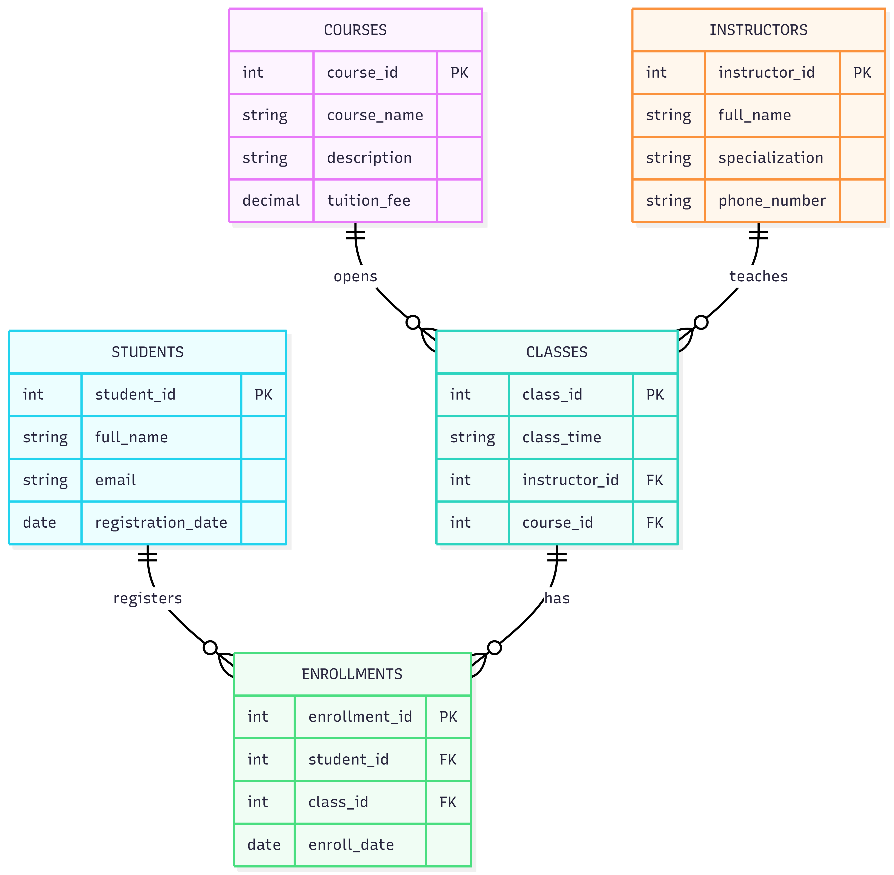

[Bài tập] Phân tích và thiết kế mô hình CSDL hoàn chỉnh

## 1. Thực thể và khóa chính:

- courses: course_id **PK**, course_name, description, tuition_fee
- instructors: instructor_id **PK**, full_name, specialization, phone_number
- students: student_id **PK**, full_name, email, registration_date
- classes: class_id **PK**, class_time, instructor_id, course_id
- enrollments: enrollment_id **PK**, student_id, class_id, enroll_date

## 2. Mối quan hệ:

- 1 course có nhiều classes:
    + courses 1 - N classes
    + FK: course_id trong classes
    + Ý nghĩa: 1 khóa học có thể được mở thành nhiều lớp học khác nhau

- 1 instructor phụ trách nhiều classes:
    + instructors 1 - N classes
    + FK: instructor_id trong classes
    + Ý nghĩa: 1 giảng viên có thể phụ trách nhiều lớp học, 1 lớp học chỉ có 1 giảng viên phụ trách

- 1 student có thể đăng ký nhiều classes:
    + students 1 - N enrollments N - 1 classes
    + Đây là quan hệ N - N giữa students và classes thông qua bảng enrollments
    + FK: student_id, class_id trong enrollments
    + Ý nghĩa: 1 học viên có thể đăng ký nhiều lớp, 1 lớp học cũng có nhiều học viên

- students và courses là quan hệ N - N:
    + students N - N courses
    + Thông qua enrollments và classes
    + Ý nghĩa: 1 học viên có thể học nhiều khóa học, 1 khóa học cũng có nhiều học viên đăng ký

## 3.ERD:

[Open ERD](./imgs/AnalysesAndDesignDBDiagram.png)

