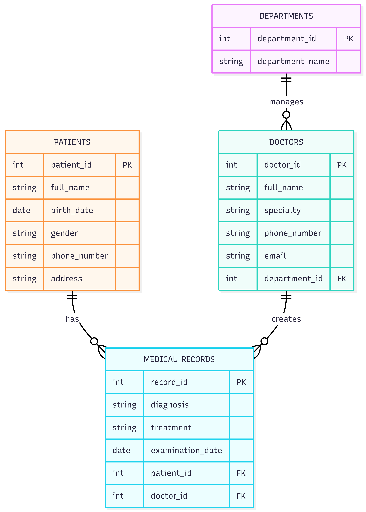

[Bài tập] Phân tích mô hình ER sang mô hình quan hệ

## 1. Thực thể và khóa chính:

- patients: patient_id **PK**, full_name, birth_date, gender, phone_number, address
- doctors: doctor_id **PK**, full_name, specialty, phone_number, email, department_id
- departments: department_id **PK**, department_name
- medical_records: record_id **PK**, diagnosis, treatment, examination_date, patient_id, doctor_id

## 2. Mối quan hệ:

- 1 department có nhiều doctors:
    + departments 1 - N doctors
    + FK: department_id trong doctors
    + Ý nghĩa: 1 khoa có thể quản lý nhiều bác sĩ, nhưng 1 bác sĩ chỉ thuộc 1 khoa

- 1 patient có nhiều medical_records:
    + patients 1 - N medical_records
    + FK: patient_id trong medical_records
    + Ý nghĩa: 1 bệnh nhân có thể khám nhiều lần và có nhiều hồ sơ khám bệnh

- 1 doctor có nhiều medical_records:
    + doctors 1 - N medical_records
    + FK: doctor_id trong medical_records
    + Ý nghĩa: 1 bác sĩ có thể khám cho nhiều bệnh nhân khác nhau

- Patients và Doctors là quan hệ N - N:
    + patients N - N doctors
    + Được tách bằng bảng medical_records
    + Ý nghĩa: 1 bệnh nhân có thể khám với nhiều bác sĩ, và 1 bác sĩ cũng có thể khám nhiều bệnh nhân

## 3.ERD:

[Open ERD](./imgs/AnalysesER2ERD.png)

