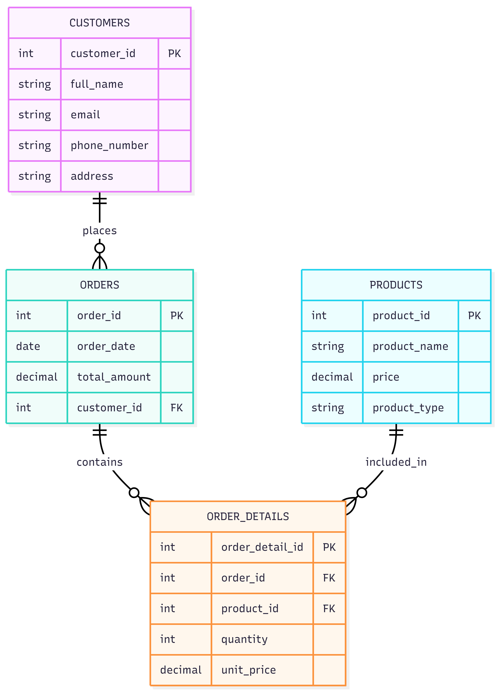

[Bài tập] Thiết kế sơ đồ ERD cho Cửa hàng Trực tuyến

## 1. Thực thể và khóa chính:

- customers: customer_id **PK**, full_name, email, phone_number, address
- products: product_id **PK**, product_name, price, product_type
- orders: order_id **PK**, order_date, total_amount, customer_id
- order_details: order_detail_id **PK**, order_id, product_id, quantity, unit_price

## 2. Mối quan hệ:

- 1 customer có nhiều orders:
    + customers 1 - N orders
    + FK: customer_id trong orders

- 1 order có nhiều order_details:
    + orders 1 - N order_details
    + FK: order_id trong order_details

- 1 product có thể xuất hiện trong nhiều order_details:
    + products 1 - N order_details
    + FK: product_id trong order_details

- Customer mua Product thông qua Order và Order_Detail:
    + customers 1 - N orders 1 - N order_details N - 1 products
    + Ý nghĩa: 1 khách hàng có thể tạo nhiều đơn hàng, 1 đơn hàng có nhiều sản phẩm, và 1 sản phẩm có thể nằm trong nhiều đơn hàng khác nhau

- Orders và Products là quan hệ N - N:
    + orders N - N products
    + Được tách bằng bảng trung gian order_details
    + FK: order_id, product_id trong order_details

## 3.ERD:

[Open ERD](./imgs/EntityRelationshipDiagram.png)

