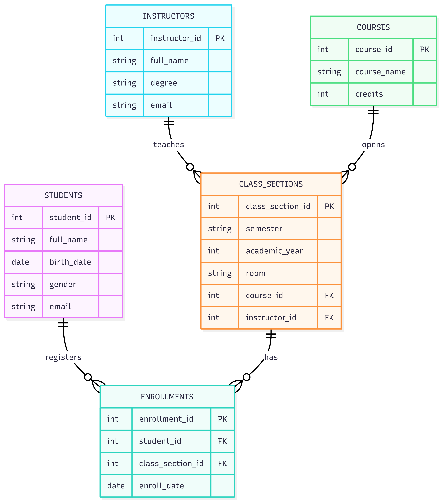

[Bài tập] Nhận diện và mô tả các mối quan hệ giữa thực thể

## 1. Thực thể:

- students: student_id **PK**, full_name, birth_date, gender, email
- courses: course_id **PK**, course_name, credits
- instructors: instructor_id **PK**, full_name, degree, email
- class_sections: class_section_id **PK**, semester, academic_year, room, course_id, instructor_id
- enrollments: enrollment_id **PK**, student_id, class_section_id, enroll_date

## 2. Mối quan hệ:

- Sinh viên đăng ký lớp học phần:
    + students 1 - N enrollments N - 1 class_sections
    + Đây là quan hệ N - N giữa students và class_sections thông qua bảng enrollments
    + Ý nghĩa: 1 sinh viên có thể đăng ký nhiều lớp học phần, 1 lớp học phần cũng có nhiều sinh viên đăng ký
    + FK: student_id, class_section_id trong enrollments

- Giảng viên dạy lớp học phần:
    + instructors 1 - N class_sections
    + Ý nghĩa: 1 giảng viên có thể dạy nhiều lớp học phần, 1 lớp học phần do 1 giảng viên phụ trách
    + FK: instructor_id trong class_sections

- Môn học có nhiều lớp học phần:
    + courses 1 - N class_sections
    + Ý nghĩa: 1 môn học có thể được mở thành nhiều lớp học phần khác nhau theo từng học kỳ/năm học
    + FK: course_id trong class_sections

- Sinh viên học môn học:
    + students N - N courses
    + Thông qua enrollments và class_sections
    + Ý nghĩa: 1 sinh viên có thể học nhiều môn, 1 môn học cũng có nhiều sinh viên học

- Giảng viên dạy môn học:
    + instructors N - N courses
    + Thông qua class_sections
    + Ý nghĩa: 1 giảng viên có thể dạy nhiều môn học, 1 môn học cũng có thể được nhiều giảng viên dạy ở các lớp học phần khác nhau

## 3.ERD:

[Open ERD](./imgs/EntityRelationshipIdentification.png)

