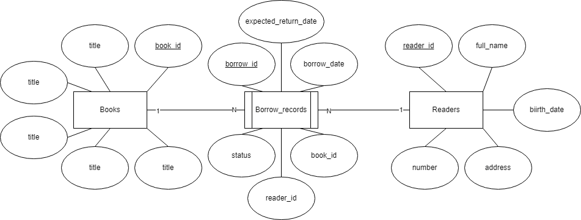

[Bài tập] Hệ thống Quản lý Thư viện - Library Management System

## 1. Thực thể và khóa chính:

- books: book_id **PK**, title, isbn, author, publish_year, category
- readers: reader_id **PK**, full_name, birth_date, address, phone_number
- borrow_records: borrow_id **PK**, borrow_date, expected_return_date, status, reader_id, book_id

## 2. Mối quan hệ:

- 1 reader có nhiều borrow_records:
    + readers 1 - N borrow_records
    + FK: reader_id trong borrow_records

- 1 book có thể xuất hiện trong nhiều borrow_records:
    + books 1 - N borrow_records
    + FK: book_id trong borrow_records

- Reader mượn Book thông qua Borrow_Record:
    + readers 1 - N borrow_records N - 1 books
    + borrow_records là bảng trung gian ghi lại thông tin mượn sách

## 3.ERD:

[Open ERD](./imgs/LibraryManagementSystem.png)

