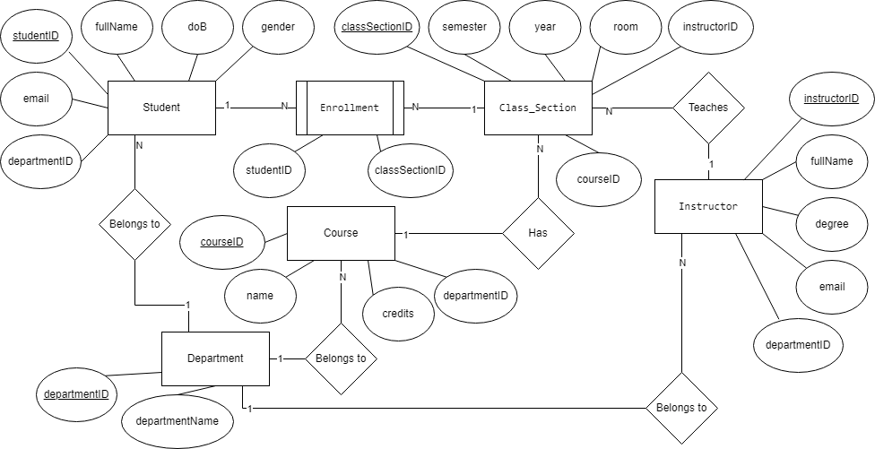

[Bài tập] Hệ thống Quản lý Đăng ký Môn học Đại học

## 1.Thực thể và khóa chính:
- Sinh viên (Student): mã sinh viên **(PK)**, họ tên, ngày sinh, giới tính, email, khoa
- Môn học (Course): mã môn **(PK)**, tên môn, số tín chỉ, khoa phụ trách
- Giảng viên (Instructor): mã giảng viên **(PK)**, họ tên, học vị, email, khoa
- Lớp học phần (Class_Section): mã lớp học phần **(PK)**, học kỳ, năm học, phòng học
- Đăng ký (Enrollment): ghi lại việc sinh viên đăng ký lớp học phần cụ thể
- Khoa (Department): mã khoa **(PK)**, tên khoa

## 2.Mối quan hệ:
- Sinh viên đăng ký (Enrollment) Lớp học phần:
    + Student 1 - N Enrollment N - 1 Class_Section
    + FK: studentID, classSectionID trong Enrollment 

- Giảng viên dạy Lớp học phần:
    + Instructor 1 - N Class_Section 
    + FK: instructorID trong Class_Section

- Lớp học phần thuộc về Môn học:
    + Class_Section N - 1 Course
    + FK: courseID trong Class_Section

- Sinh viên, Giảng viên, Môn học thuộc về Khoa:
    + Student N - 1 Department 
    + Instructor N - 1  Department
    + Course N - 1 Department 
    + FK: departmentID trong Student, Instructor, Course 

## 3.ERD:

[Open ERD](./imgs/UniversityEnrollmentManagementSystem.png)

